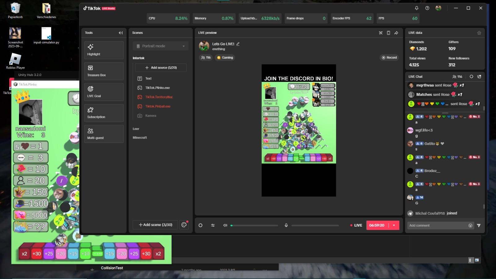

# TikTok.BallGame (Plinko)

## Overview

**TikTok.BallGame** is a high-engagement, interactive Unity-based gaming platform that bridges the gap between livestreaming and multiplayer gaming. By integrating real-time TikTok Live events directly into a physics-based Plinko simulation, the project creates a dynamic "Binomial Distribution" style game where the audience’s actions—likes, comments, follows, and gifts—directly influence the game world.

Originally built using reverse-engineered API protocols before the release of the official TikTok SDK, this project demonstrates a robust architecture for real-time event ingestion, scalable bot management, and audience-driven gameplay loops.

**Note:** This project has been used commercially to generate over €8,000 in direct livestream revenue and supported a subscription-based model for creators.

> *Secret: the original image is `preview2_original.png`. This version was expanded to a wide aspect ratio using AI to better fit the GitHub header aesthetic.*

---

## Technical Architecture

The platform operates through a multi-tier architecture consisting of a Python-based event bridge, a Unity game client, and a centralized distribution hub.

### 1. Real-Time Event Ingestion (Python Bridge)

Because the project predates official SDK availability, it utilizes a custom-built event protocol to scrape and dispatch TikTok Live data.

* **API Reverse Engineering**: Implemented a scraper to monitor TikTok's Webcast API, extracting protobuf-encoded data streams for real-time interaction.
* **Event-Dispatch System**: A scalable Python backend that manages multiple concurrent livestreams across distributed VPS infrastructure.
* **Socket Communication**: Uses a low-latency TCP/UDP socket layer to transmit processed TikTok events (e.g., `GIFT_ID_102`, `USER_FOLLOW`) into the Unity game engine.

### 2. Unity Interaction Engine (C#)

The game client is engineered to transform abstract social metrics into physical game objects.

* **Dynamic Spawning**: Each interaction triggers a physical "Ball" spawn. The "weight" or "value" of the ball is mapped to the gift's value, creating a visual hierarchy of importance.
* **Binomial Physics**: The board is designed as a Galton Board (Binomial Distribution). As balls collide with pegs, they follow a path dictated by gravity and randomized collision physics, eventually landing in multiplier slots.

* **Backward Compatibility**: The architecture was successfully migrated from the custom Python bridge to the official TikTok/Unity SDK while maintaining the core event-trigger logic.

---

## Key Capabilities

* **Monetization Triggers**: Direct mapping of TikTok gifts to in-game rewards, driving high-frequency donations from the audience.
* **Automated Deployment**: Includes an official, Windows-licensed Installer for the **Intertok Hub**, allowing streamers to manage subscriptions and update game modules seamlessly.
* **Scalable Infrastructure**: Built to handle bot-managed accounts and high-traffic streams with thousands of concurrent viewers without physics desync.
* **Community Managed**: Integrated with a Discord-based authentication system to support a 600+ member creator community.

---

## Build & Tech Stack

* **Game Engine**: Unity (C#)
* **Backend**: Python (Event scraping & Proxy management)
* **Distribution**: C#/.NET (Windows Licensed Installer)
* **Networking**: WebSockets / Custom TCP Protocol
* **Infrastructure**: Distributed VPS for 24/7 automated streams

---

## Commercial Success

The **Intertok** ecosystem was not just a technical PoC, but a proven commercial product:
* **Direct Revenue**: Generated approximately **€8,000** via TikTok Live gifts during testing and official runs.
* **SaaS Model**: Successfully commercialized via a **€60/month** subscription, providing streamers with the tools to host their own interactive Plinko sessions.

---

## Disclaimer

This repository is part of the Intertok Software Suite. It is intended for portfolio demonstration and historical archival of the platform's development. All reverse-engineering techniques were developed for interoperability research prior to official API releases.